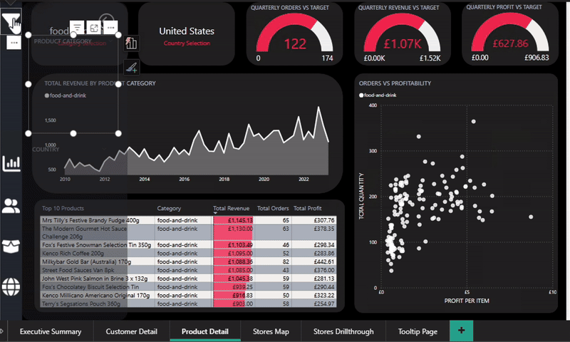
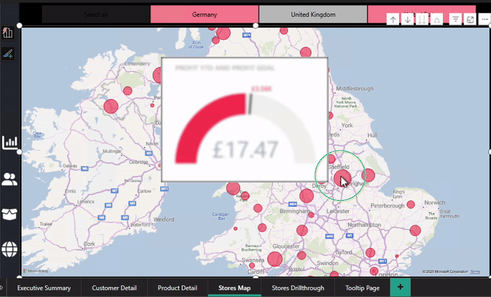

# Data Analytics Power BI Report

## Table of Contents

- Introduction
- Installation Instructions
- Description of Project Tasks
    - Loading Data
    - Building the Data Model
    - Creating the Report
    - SQL Queries
- Project File Structure
- Licensing Information

## Introduction

Design a business Quarterly report for an international retail business using Power BI. The audience will be the business's C-suite executvies, as well as the Product teams and Regional Managers.

With operations spanning across United Kingdom, Germany and the USA, the business has accumulated large amounts of sales from disparate sources over the years, dating back to 2010. The majority of their stores are bricks and mortar retail stores, with a small amount of online sales through their web portal.

The goal of the project is to use Microsoft Power BI to design a comprehensive Quarterly report, focusing on performance of their products and stores, and highlighting their best customers. The project tasks will involve extracting and transforming data from various origins, designing a robust data model rooted in a star-based schema, and constructing a multi-page report to provide actionable insights to help better decision making.

The report will include:

- An Executive Summary page: to give an overview of company performance and check KPIs.
- A Customer Detail page: to show analysis of customer data and highlight high values customers.
- A Product Detail page: to provide an in-depth look at which products are performing well, with the ability to drill down into more detail about the product categories and performance by region.
- A Stores Map: for regional managers to track stores' quarterly profit and revenue targets.

Following completion of the report, the business has also asked for five SQL queries to be written in order to extract further insights from the data, and share these with a broader audience who do not have access to Power BI.

## Installation Instructions

To view the report, Microsoft Power BI is required. Power BI Desktop can be downloaded for free from Microsoft's website to view and edit the report.
https://www.microsoft.com/en-us/download/details.aspx?id=58494
However a license for Power BI Service is requried to publish and share reports amongst other Power BI users.

Please note if using a Mac or Linux operating system you will need to run Windows on a virtual machine through a platform like Azure or Oracle.

## Description of Project Tasks

What follows is a descrption of the steps I took to complete each of the tasks to create the Power BI report.

### Loading Data

The business has several sources of data in various locations and formats, including an Azure SQL Database and CSV files. Below is an overview of the process to extract, load and transform the data for each table, using Power BI's Power Queary Editor.

The Orders table is held in an Azure SQL Database. After loading the data from Azure,
I used the Split Column feature to separate the date and times from the [Order Date] and [Shipping Date] into their own columns.

Then apllied a filter to the [Order Date] column to uncheck any rows with null values so they would not be imported into the final Orders tablein Power BI.

After loading the CSV using Power BI's data connector, to transform the data, I used the Remove Duplicates function on the product code column to ensure each product code is unique, and then removed any remaining nulls by unchecking the 'blanks' in the column filter dropdown.

The Stores table is saved in a CSV file on in a Azure Blob Storage container. After connecting and loading the data, I used the Combine Files button in the Power Query Editor to convert the data from the Stores.csv to ensure the data loaded correctly.
Unnecessary columns that were created during the CSV conversion process were then removed. 

Was completed, I used the Replace Values function to correct the errors with some of the values in the Region column.

As the three region's customer data were in individual CSV files, I used Power BI's Combine and Transform feature to combine the CSVs and load as one table.

Then, for later use in the report, I created a Full Name column by combining the [First Name] and [Last Name] columns.

For each of the above tables, I renamed the tables to a single descriptive word without any abbreviations, and the columns were renamed to desciptive words using spaces, as opposed to underscores or hyphens.  

## Bulding the Data Model

Once all the tables were in Power BI, I set up a dates table, the star-based schema for the database and established the relationships and cardinality between the tables and primary keys. 

In order to make use of Power BI's time intelligence functions, I created a Date table with a contiguous set of dates from the date of the business's first order date until the end of the 'current' year of the dataset (2023) using the below function:

Dates = CALENDAR(MIN(Orders[Order Date]), DATE(2023,12,31))

I had observed that the first order was 01/01/2010 and the last was in June 2023. So I used the MIN(Orders[Order Date]) function to create the earliest date, and, as I needed to include all dates to the year end from the last date in the Orders['Shipping Date'] column, I used the specfic date 31/12/2023 in the measure to complete the date range.

I then created several new columns in the Date table and established a hierarchy for use when building the visuals in the report.

Some examples of the DAX functions I used for the new date columns are:
- Day Of Week = FORMAT('Dates'[Date], "dddd") 
- Month Number = MONTH(Dates[Date])
- Year = YEAR(Dates[Date]) 
- Start Of Week = Dates[Date] - WEEKDAY(Dates[Date],2) + 1
- Start Of Quarter = STARTOFQUARTER(Dates[Date])
- Quarter = FORMAT(Dates[Date], "\Qq")

When using the FORMAT function for the Quarter column, I wanted the format to be easily readible so opted for Q1 format, which was achieve buy using the \Qq format_string.

The Dates tables was then marked as a Date Table in Power BI to ensure the measure I created later in the project would work with the time intelligence functions . 

To build the star-based schema, I used Power BI's Relationship Manager to set up the relationships between each of the tables using :

- Products[Product Code] to Orders[Product Code]
- Stores[store code] to Orders[Store Code]
- Customers[User UUID] to Orders[User ID]
- Dates[Date] to Orders[Order Date] (ACTIVE)
- Dates[Date] to Orders[Shipping Date]

All the relationships cardinality was set to one to many in a single direction between the dimension tables and the Orders fact table. And The Date[Date] to Order[Order Date] was set as the active relationship between those to tables. 

Below is a image of the star-based schema displaying each of the tables and their connecting relationships. 

After creating a dedicated Measures table, I wrote the below measures using DAX formula language for specific calculations to be used in the report:

- Total Orders = COUNTROWS(Orders)

- Total Quantity = SUM(Orders[Product Quantity])

- Total Revenue = SUMX(Orders, Orders[Product Quantity] * RELATED(Products[Sale Price]))

- Total Profit = SUMX(Orders, (RELATED(Products[Sale Price]) - RELATED(Products[Cost Price])) * Orders[Product Quantity])

- Total Customers = DISTINCTCOUNT(Orders[User ID])

- Revenue YTD = TOTALYTD([Total Revenue], Orders[Order Date])

- Profit YTD = TOTALYTD([Total Profit], Orders[Order Date])

In the Stores table, I needed to create some additional columns for some of the visualisations used in the report. A new Country column was created using the Switch function to apply the country name to each store based on its Country Code. And a new Geography column was created by concatenating the text strings from the Country Region and new Country columns together using the & operator.

Finally, a geography heirarchy was created for use in the map visualisation in the report.

## Creating the Report

I used the Sticky Strawberry theme from the Microsoft Fabric community's theme gallery. To give the report a stylish feel, whilst maintaining a clear and readable visual asthetic overall. 

For the Customer detail page, I have shown several important data points about the business's customers.
These include the visuals displaying the total number of unique customers, revenue, a line graph charting the number of customers, and details about the top customers based on revenue.

#### Headline Visual Cards

The headline visual cards reflect the values of Total number of customers and average revenue per customer.
These cards will update as the date slicer is adjusted.

#### Summary Donut Charts

These charts display Total customers by County and product category. 
Using the donut chart to display the share of countries and categories by customer:

 

The slices on the donut chart can be easily colour coded in Power BI's Report view Format Pane's Slices > Colours section:

With cross-filtering applied, the user can click on the slices within the donut charts and the other visuals across the page will update accordingly. For example, if a user wanted to see the top customers and average revenue for Toys and Games, they could click on the toys-and-games slice and the cards and customers table would update automatically. 

#### Customers Trending Line Chart

Using a line chart to display the how the total number of customer has changed over time. 

The chart can be drilled down into years, quarters and months to display more detailed data as required.

I also added a trend line from the visuals Format pane:

Using the 'Forecast' feature we can show, based on the existing data, the forecasted continuation of total customer numbers. This is displayed at the right hand side of the line chart in the shaded area.

The forecast displays a 95% confidence interval, with the shaded area around the forecast line. This can adjusted in the Format > Forecast pane.

#### Top Customer Data 

Using the Table visual, I created a table of the top 20 of customers, displaying their full name, revenue and number of orders. 

The full list of customers was filted using the Top N filter in the page's Filter pane to narrow down the rows to the top 20.

I then added data bars to the revenue column using the Cell elements from the format pane with the below options:

Users can click on each of the column headers to sort the table by ascending and desending values.

I also created cards for the top customer's name, reveue and number of orders on the right hand side of the page. Nice work Conor Williams! (no relation.)

#### Date slider

To finish off I added a date slider to allow users to filter the page by year.  This will affect all the visuals on this page of the report. For example, the Top Customer cards and product category donut charts will update according to the range of years selected with the slider.

The next task was to create a dashboard style report page for a high level summary of key metrics to give an overview of the company's performance.

#### Card Visuals for Key Metrics

Simple card visuals were used to display some of the key measures on the business performance.

#### Revenue Trending Line chart

I used the line chart again, this time to the total revenue from 2010 onwards. Included are a trend line and forecasting.

#### Revenue by Country and Store Type Donuts Charts

In a similar style to the donut charts on the Customer Page, these are visuales showing Total Revenue broken down by the stores' countries and store type.

#### Bar Chart of Orders by Product Category

Using a simple bar chart to display the number of orders per product category. 

#### KPI Cards

Using the PREVIOUSQUARTER DAX function, I created Target revenue, profit and orders measures for KPI visuals. These targets are equal to 5% growth in each measure compared to the previous quarter.

As an example, the DAX formaul for the Target Revenue measure is:

Target Revenue = 
CALCULATE(
    [Total Revenue],
    PREVIOUSQUARTER('Dates'[Date])
) * 1.05

This Target Revenue measure is used to as the 'target' field in the KPI card, and when the page is filtered on a particular quarter, the three KPI visuals will update to reflect the peformance for that quarter compared to its target (a 5% increase from the previous quarter)

The below image shows how I set up the Trend axis, in this case 'Start of Quarter', so that the colours and icons change depending upon how the revenue, profit or number of orders performed compare to the target. - white is good, red is bad - alongside an icon to emphasise this.

      

#### Cross-filtering

Cross-filtering is a key feature of this page to alllow snr managment to drill down in more detail as required. Users can click on different quarters in the line graph and the visuals will update accordingly. For example, by clicking on Q2 2023, the KPI cards will update to show company performance for that quarter. 

The Product page is page is designed to give both a top-line overview of the products' performance and, using the page's slicer toolbar, an in-depth look at each product category and region.

#### Current Quarter Performance Gauge Visuals

Three gauge's show the revenue, profit and orders of the current quarter's performance when compared to a target of the previous quarter's value + 10%.
The guages were set up with the Total Profit as the value and then the 10% Target as the Max value in the guage:

By adding conditional formatting to colour of the guage, the callout value will change to red if the goal had not yet been reached.

Finally a filter was added to each of the guages to filter the data just for the current quarter.

#### Using an Area Chart to Display Revenue by Product Category

This chart displays how the different product categories have performed over time, allowing the products team to identify any trends from past peformance. Again this chart can be filtered by product category and region using the toolbar slicer or clicking within the graph on different time periods to drill down further, also updating the scatter graph and Top 10 products for that time period as well.

#### Top 10 Performing Products Table

Using a table to visualise the top 10 products across the business. Displaying the total revenue, total orders and total profit for each product. Again the table will adapt following user selected filtering from the slicer toolbar.

#### Scatter Graph of Quantity Sold vs Profit per item

To assist the Product Team in making recommedations for products to the marketing team for promotional campaigns, I created a scatter graph to visualise which product ranges are top-selling items and make the most profit, and, using the page's slicer (see below), the graph can be filtered by product category and/or country for specific regional focus. 

#### Slicer Toolbar

To manage how the page is filtered, I set up a slicer toolbar that, upon clicking the filter icon in the navigation bar, pops-out to reveal the slicer options for Country and Product Category. Making it easy for users to filter the page to drill down into the data for each product and region further.

After setting up the slicers on the toolbox, I used Power BI's bookmark feature to take snapshots of the toolbar open and closed.  Then, using the bookmark pane, I assigned the corresponding bookmark to the filter button at the top of the navigation bar. Finally adding a back button on the toolbar to close the toolbar to avoid it getting in the way of the visuals.

To keep track of the current slicer filter state of the product page, cards were added at the top left of the page showing the product category and region selections.

To visualise the performance of the store, and for regional managers to check on the stores under their control, I created a Store Map page. Each bubble on the map represents a store's Profit year to date.

Each region can be zoomed in for closer insepction and, using Power BI's Tooltips, by hovering the cursor over each bubble, users can see a store's Profit YTD compared to a target profit from the previous year's same year to day period + 20%. 

Displaying visuals as tooltips is set up from the visual's Properties page by selecting a seperate page reserved for Tooltip visuals from the Options drop down list.

Users can also filter the map using the region slicers at the top of the page.

To drill down into more detail on a particular store region, users can zoom into the store they wish to look at and right click on the store region's bubble, and then select Stores Drillthrough. This will take the user to a separate page displaying that store region's top 5 products, total orders by category and how it is performing against its profit and revenue goals.

#### Stores Drillthrough Page

The drillthrough feature is set up by creating a separate drillthrough page and selecting it as Drillthrough type in the Page information section of its Format pane.

On the stores drillthrough page, there are year-to-date measures for Profit and Revenue, as well as goals for each.
As mentioned above, the goals are based on the store's previous year-to-date performance plus 20%. To calculate the goals I used the SAMEPERIODLASTYEAR function, as the measure would then update depending upon which quarter a user wished to look at. 

The DAX measure for Revenue Goal:

Revenue Goal = 
CALCULATE(
    [Revenue YTD], 
    SAMEPERIODLASTYEAR('Dates'[Date])
) * 1.2

#### Cross-Filtering

To enhance the user experience, I have used Power BI's cross-filtering feature to filter the visuals on a page when a data point on one visual is selected. However we don't always want all visuals to be updated in this way, so using the Edit Interactions button I restricted some of the visuals to not cross-filter when selected. For example on the Orders vs Profitability scatter graph on the Product Detail page, I did not want this to affect any other visual when datapoints were selected, as the points on the scatter graph were individual products and too granualar for this report.

#### Navigation Bar

For each page, I created a Navigation bar so users can easily switch between pages. This was set up by inserting Buttons on the navigation bars and assigning Page navigation as the button's actionin the Format > Button Style pane. An image was then added to the button icon to match the colour theme of the report. 

The final task of the project was to write SQL queries on the database to answer five questions that could be shared with a broader audience. 

Each SQL query file, and its corresponding answers in a CSV file, are saved in the sql_queries_and_csvs folder in the repository, as well as CSVs of the tables names and columns. 

Notes on the SQL queries:

As I wanted to round any resulting currency based values or percentages to 2 decimal places using the ROUND function, I had to use the '::numeric' syntax to cast some of the double precision column values (e.g. sale price) as numeric data types. This meant using the ROUND function lead to some of the SQL queries being quite long.

For question 4, within the .sql file there are two separate SQL statements. One to create the SQL view called store_performance, and an additional SELECT statement to view the result.

## Project File Structure

 * data_analytics_power_bi_report
   * Data Analytics Power BI Report Project - Final.pbix
   * README_images_and_gifs [FOLDER]
   * README.md
   * sql_queries_and_csvs [FOLDER]
     * questions_sql_and_answer_csvs
     * table_and_column_names [FOLDER]
   
## License Information
This repository is unlicensed as it is intended only for training purposes.

